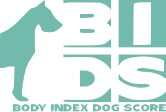
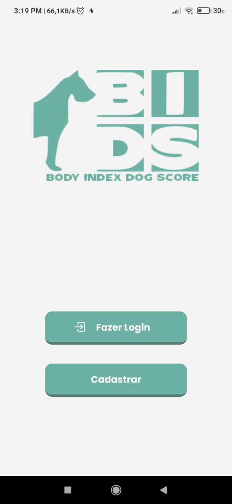

<h1 align="center">
  BIDS
  

  Um app para auxiliar você a cuidar da saúde do seu pet
</h1>

  
  

# 🧾 》Introducao
Esse projeto na verdade é um trabalho da faculdade, o objetivo era fazer um mvp para um aplicativo que ajudasse os donos de pets a identificar e tratar a obesidade,
No nosso caso resolvemos deixar nichado apenas a cachorros.

# 🧰 》Tecnologias usadas
Para desenvolver o app foi usado o conjunto básico de ferramentas no desenvolvimento mobo, nada muito fora do comum.
- React Native 
- Node.js 
- Expo 
- Firebase

# 📷 》Imagens do MVP

  
  
  
  
  
  

